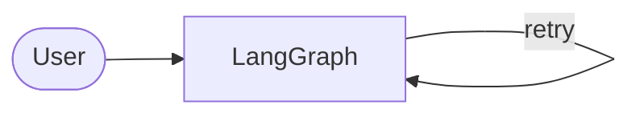

# Writing a project README, with Mermaid diagrams

*(short note)* Checked 2026-10-08 against the GitHub docs, the Mermaid flowchart docs and the mermaid-cli README.

## 1. What and why

**Problem:** a reviewer opens your repo, skims for under two minutes, and decides whether to read on. Most never scroll.

- **Inverted pyramid:** the most important thing first, detail later. Order used here: one paragraph (what and why), a "Results at a glance" table, one real example conversation, architecture diagrams, "Run it", then the detailed evaluation sections, what failed and was learned, limits, repo map, "How it was built".
- **Headline numbers before explanations.** A table of results is skimmable; a paragraph isn't.
- **A real example beats a description.** A pasted conversation from `python graph.py`, with translations, shows the behavior in ten seconds.
- **Honest limits and AI-assistance disclosure build trust.** A reviewer who finds an overclaim stops trusting everything else. Saying what failed, what you measured and that an AI coding assistant wrote most of the code (and what you did: choices, tests, reading, evals) reads as maturity and is easy to defend.
- **The cold-read test:** a fresh agent with no context read only the first ~120 lines and had to explain the project back. Wrong or missing parts show what the README fails to say. Do this with a person too.
- makeareadme.com's checklist (name, description, installation, usage, visuals, license, status) is a good baseline; it also says "too long is better than too short", which is why detail sits below the summary rather than being cut.

## 2. In this repo

`README.md` has two Mermaid diagrams plus a node table. Mermaid is diagrams written as text in a code fence:

````

````

- GitHub renders `mermaid` fences **in the browser**. A syntax error shows an error box on the page, not a failed build, so you must look at the rendered result before publishing.
- Syntax used: `flowchart LR` or `TD` (direction); node shapes `["rectangle"]`, `(["stadium"])`, `[("cylinder")]` (a database); labeled edges `A -- label --> B` or `A -- "quoted label" --> B`; `<br/>` for line breaks; a self-loop (`lookup -- "retry" --> lookup`); bidirectional `A <-- label --> B`. Quote labels that contain punctuation.
- **Bug hit today:** a node id named `graph` gave `Parse error on line 3: Expecting … got 'GRAPH'`. `graph` is a Mermaid keyword, and so is `end` (the docs say to write `End` or `END`). Fix: renamed the id to `lg`. If a parse error points at a plain-looking word, suspect a keyword.
- **Render locally:** `npx -y @mermaid-js/mermaid-cli -i d1.mmd -o d1.png -b white -s 2`. The package is `@mermaid-js/mermaid-cli` and the command it installs is `mmdc` (hence `-p` form in its README: `npx -p @mermaid-js/mermaid-cli mmdc ...`). `-i` input, `-o` output, `-b` background, `-s` scale. It drives a headless Chromium through puppeteer, so it needs a download and can hit Linux sandbox issues. A missing local font showed `₾` as a box; browsers are fine.
- **Quicker check:** paste the diagram at mermaid.live (live editor), or preview the file on GitHub.

## 3. How it fits

README is the front door; `docs/code/` (line-by-line), `DECISIONS.md` (why) and `learning/notes/` (concepts) are the rooms behind it. Mermaid keeps the architecture diagram in the same text file as the code, so it can be diffed and updated with it, unlike a screenshot.

## 4. Related tools

- **draw.io / Excalidraw:** prettier, manual, and the source drifts from the code. Good for slides.
- **PlantUML, Graphviz:** older text-to-diagram tools; GitHub doesn't render them in Markdown.
- **LangGraph's own `get_graph().draw_mermaid()`:** produces Mermaid for the graph automatically (see the LangGraph note); the README diagram is hand-written to also show MCP and storage.

## Sources

- GitHub, creating diagrams: <https://docs.github.com/en/get-started/writing-on-github/working-with-advanced-formatting/creating-diagrams> (fence syntax; the `info` command shows GitHub's Mermaid version).
- Mermaid flowchart syntax: <https://mermaid.js.org/syntax/flowchart.html> (shapes, edge labels, reserved word `end`).
- mermaid-cli: <https://github.com/mermaid-js/mermaid-cli> (npx usage, flags, Chromium note).
- Make a README: <https://www.makeareadme.com/>.
- Mermaid video tutorials page (I confirmed these on it): "Hands on - Text-based diagrams with Mermaid", Chris Chinchilla, <https://www.youtube.com/watch?v=4_LdV1cs2sA>; "Can you code your diagrams?", Eddie Jaoude, <https://www.youtube.com/watch?v=9HZzKkAqrX8>.
